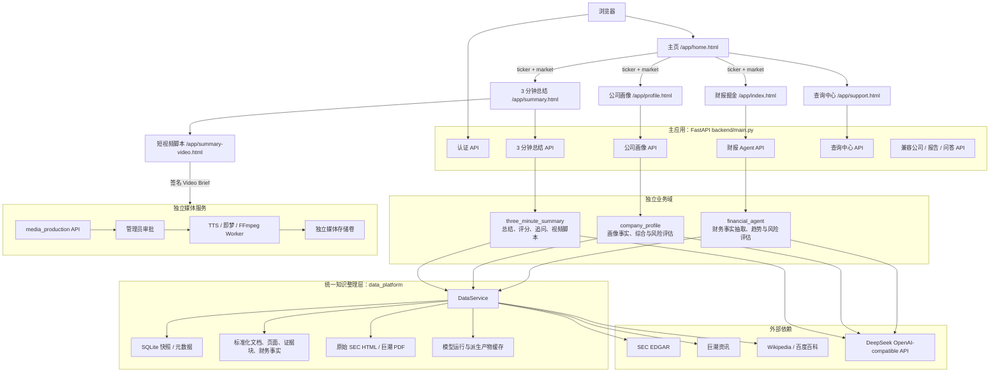
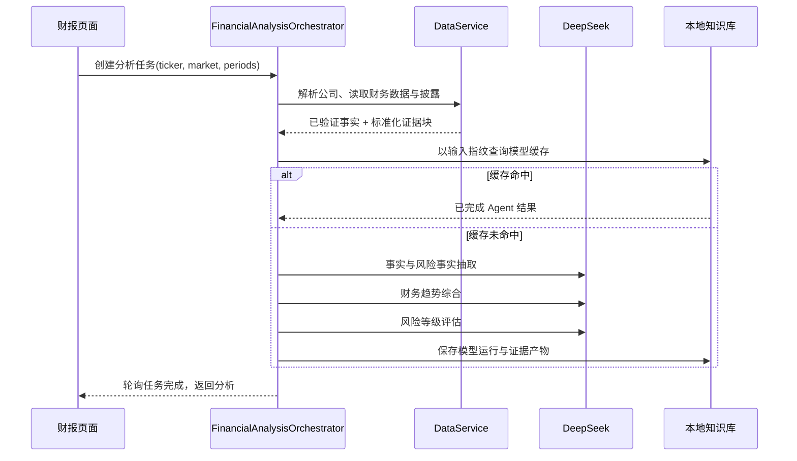

# 架构与数据流

## 系统组件图

## 强制解耦边界

1. `app/home.*` 仅负责输入、认证状态和跳转，不能包含财报、画像或总结的业务编排。
2. `financial_agent`、`company_profile`、`three_minute_summary` 是独立领域；允许共享 `DataService` 和标准化知识，但不直接互相 import 内部实现。
3. `data_platform` 可以访问外部公开数据源；业务域不应绕过它直接调用 SEC、巨潮或百科 Client。
4. `media_production` 只接收签名 `Video Brief`，使用独立存储与环境变量，禁止读取主应用 SQLite、财报缓存和 DeepSeek Key。
5. 前端页面仅经 HTTP API 耦合，不能依赖其他页面的 JavaScript 状态。

## 财报 Agent 时序

