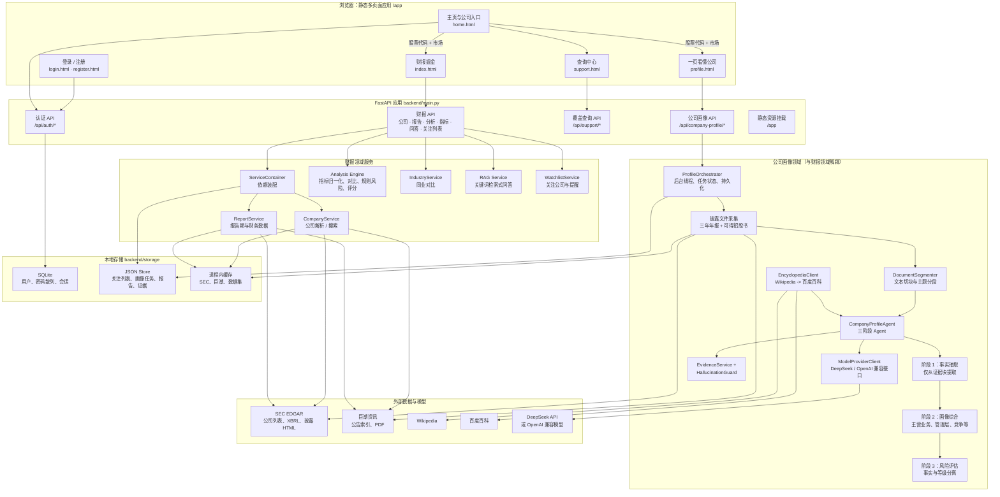

# 财报掘金系统架构（当前实现）

> 本文基于当前代码梳理，描述运行时模块边界与主要数据流。

## 1. 系统定位

系统由三个相互独立的用户侧能力组成：

- **财报掘金服务**：按公司和报告期从本地数据平台获取美股/A 股结构化财务数据，输出指标、趋势、规则风险、同行对比与问答。
- **一页看懂公司（公司画像）**：读取最近三年年报和可得的招股书，以大模型进行分阶段事实抽取、公司画像综合和非财务风险评估。
- **查询中心**：查询当前数据源可覆盖的公司；仅通过导航与主页关联，不参与财报和画像的业务编排。

认证、主页和以上功能页面均是静态页面；FastAPI 作为统一 API 与静态资源入口。

## 2. 总体架构图

## 3. 前端与导航边界

| 页面 | 主要文件 | 职责 | 与其他页面的关系 |
| --- | --- | --- | --- |
| 登录、注册 | `app/login.html`、`app/register.html`、`app/auth.js` | 账户创建、登录、会话检查 | 登录成功后进入主页 |
| 主页 | `app/home.html`、`app/home.js` | 公司/市场输入，跳转到财报服务或公司画像 | 只传递查询参数，不承接分析业务 |
| 财报掘金 | `app/index.html`、`app/app.js` | 报告期选择、财报分析、问答、关注列表 | 独立调用财报 API |
| 公司画像 | `app/profile.html`、`app/profile.js` | 创建任务、轮询任务、展示画像和证据 | 独立调用公司画像 API |
| 查询中心 | `app/support.html`、`app/support.js` | 查询数据源覆盖范围 | 仅能返回主页 |

## 4. 财报掘金数据流

1. 前端将股票代码和市场传至公司/报告 API。
2. `CompanyService` 根据市场路由到 SEC 或 A 股数据源，返回标准公司实体。
3. `ReportService` 获取可选年报/季报及财务数据：美股读取 SEC XBRL，公司 A 股读取巨潮公告和 PDF 文本。
4. `analysis_engine.py` 将指标归一化，计算同比/环比、比率、趋势、规则风险和综合评分。
5. 同行业对比由 `IndustryService` 编排，问答由 `rag_service.py` 从本次分析生成的 `rag_chunks` 中做关键词检索。

该链路的核心输出是**结构化财务指标与可复现的规则结论**；它并不调用公司画像 Agent。

## 5. 公司画像 Agent 数据流

1. `ProfileOrchestrator` 创建后台任务，解析公司与市场，并采集最近三年年报；存在可用招股书时一并纳入。
2. A 股从巨潮下载 PDF 并按页提取文本；美股从 SEC 获取 10-K/20-F 和 S-1/F-1 披露 HTML。
3. `DocumentSegmenter` 保留来源文档和页码/块 ID，将全文拆成可追溯的证据块。
4. `CompanyProfileAgent` 分批调用模型：先抽取结构化事实，再仅依据这些事实生成画像，最后将风险事实与风险等级评估拆开处理。
5. 当披露材料缺少基础信息时，`EncyclopediaClient` 先查询 Wikipedia，失败后查询百度百科；百科内容同样进入模型分析，但被提示词限定为基础补充，不能覆盖披露事实。
6. `EvidenceService` 校验证据块引用，`HallucinationGuard` 对缺少证据的关键字段降级或标注不确定性，最终把报告、证据和任务状态写入 JSON Store。

## 6. 数据、配置与运行边界

- **SQLite**：认证数据（用户、密码散列、会话），实现位于 `backend/repositories/sqlite_store.py`。
- **JSON Store**：业务轻量持久化，包括关注列表和公司画像任务/报告/证据，实现在 `backend/repositories/json_store.py`。
- **数据平台缓存**：公司、公告元数据、原始披露文件、解析文本、财务指标、百科快照和公司画像均持久化在 SQLite 与本地资产目录中；进程内缓存仅作为适配器级优化。
- **模型配置**：由 `backend/company_profile/llm_client.py` 读取本地环境变量，支持 DeepSeek 默认配置和 OpenAI 兼容配置；密钥不应进入仓库。
- **异步模型**：公司画像采用后台线程 + 前端轮询，不使用消息队列或独立任务服务。

## 7. 当前关键技术边界

- 财报分析的风险提示来自 `analysis_engine.py` 的规则；公司画像的非财务风险来自模型抽取事实后再独立评估，两者语义不同。
- A 股 PDF 若为扫描件或表格可提取性差，可能导致结构化财务指标或画像材料不足；系统会保留失败原因。
- 公司画像 API 目前未做鉴权与任务数据归属校验，这是当前已知、被暂缓处理的安全边界。
- 所有外部数据源和模型服务均依赖网络可用性、上游访问限制与数据质量。

## 8. 主要代码入口

- 应用与路由注册：`backend/main.py`
- 领域服务装配：`backend/services/container.py`
- 财报规则分析：`backend/services/analysis_engine.py`
- SEC 数据访问：`backend/services/sec_client.py`
- 巨潮资讯与 PDF 解析：`backend/data_sources/cninfo_client.py`
- 公司画像任务编排：`backend/company_profile/orchestrator.py`
- 公司画像 Agent：`backend/company_profile/agent.py`
- 大模型客户端：`backend/company_profile/llm_client.py`
